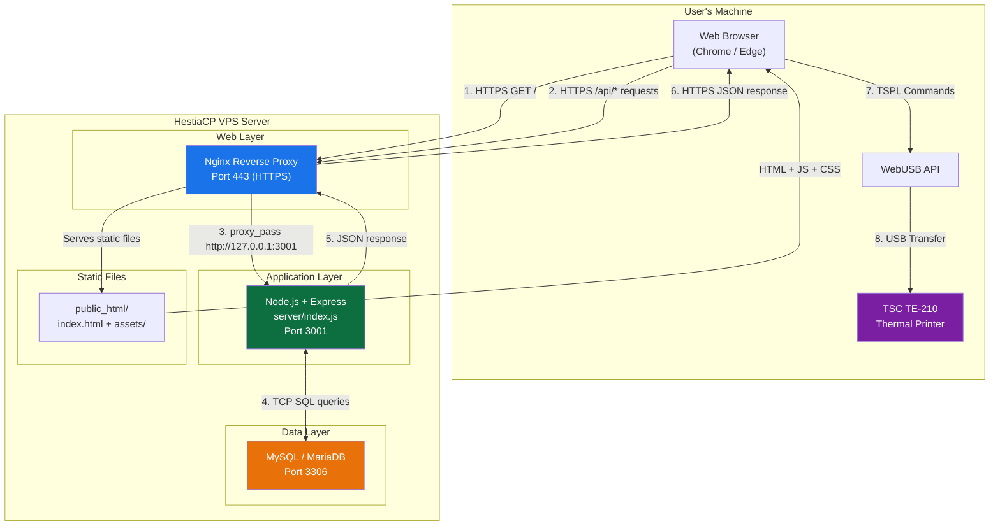
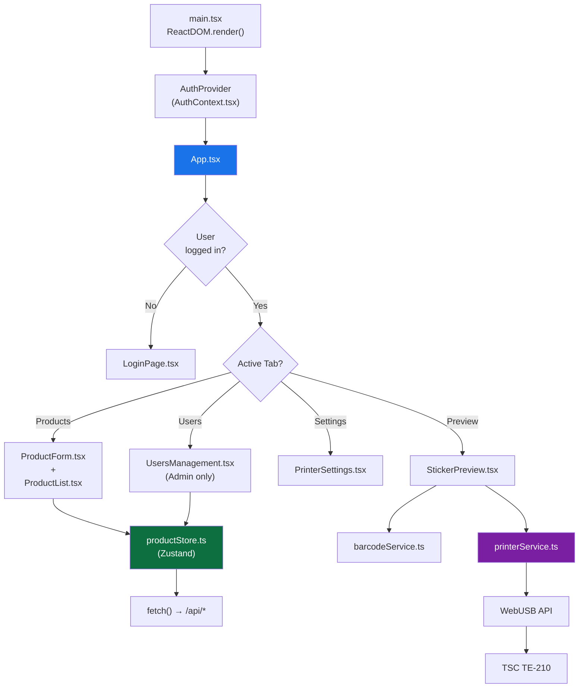
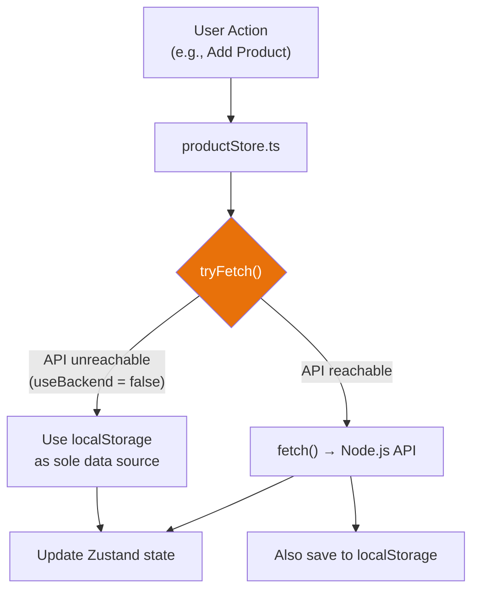
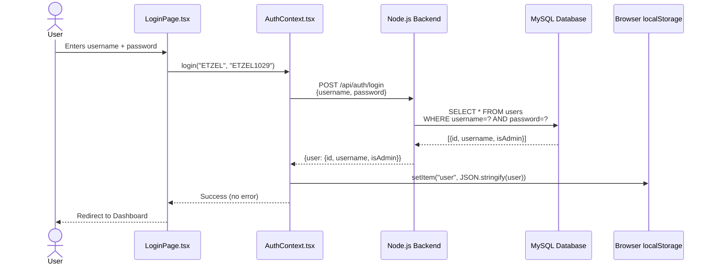
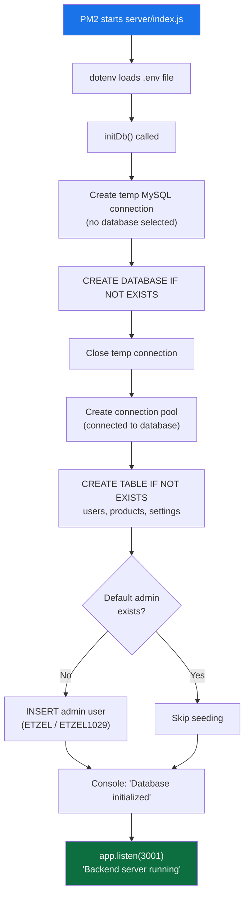
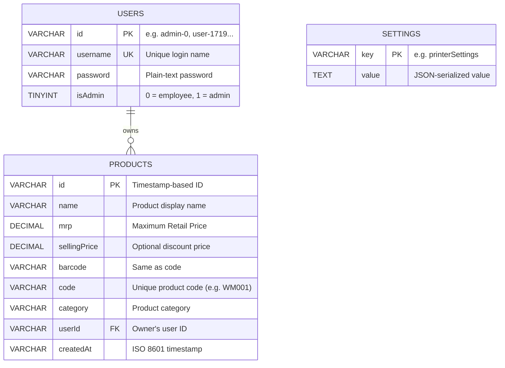
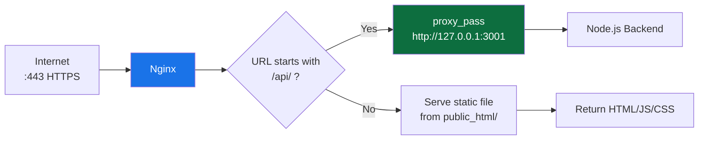
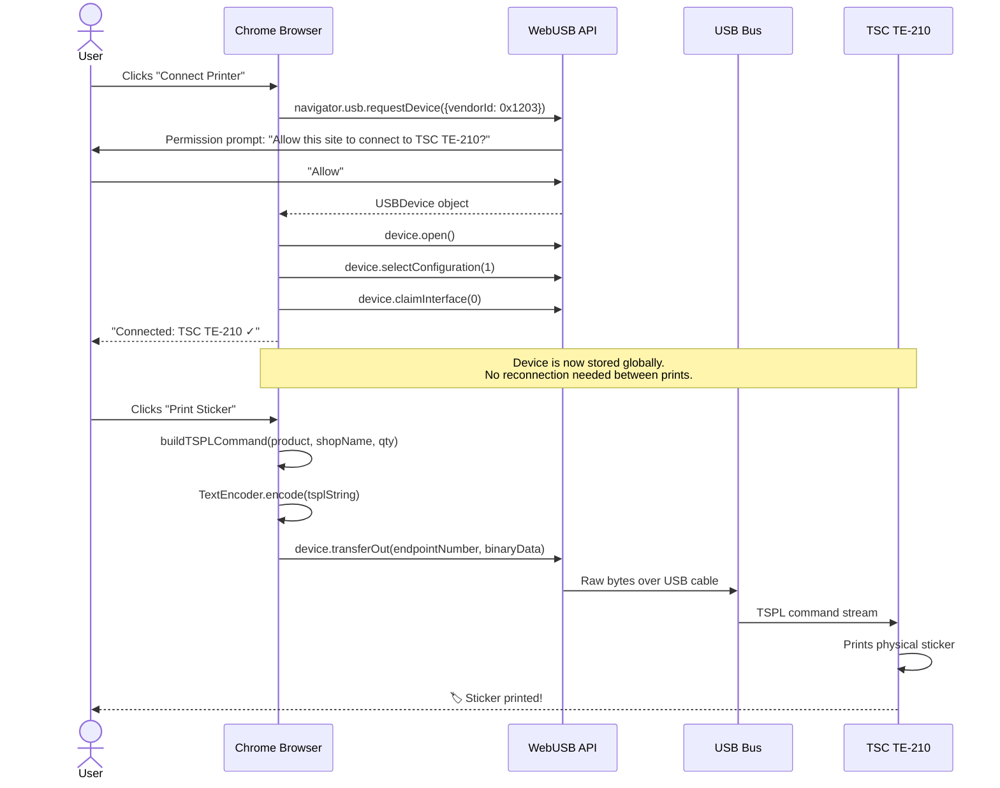
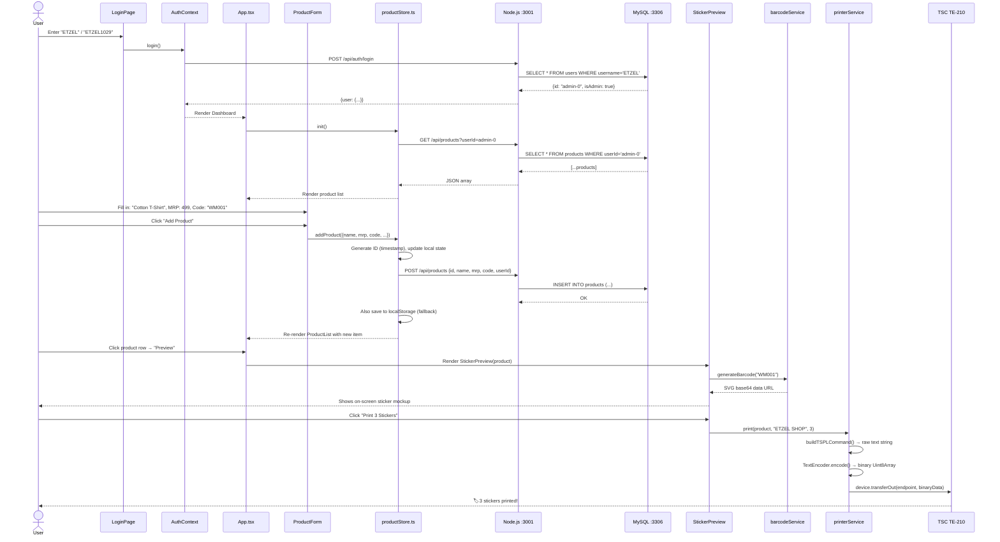

# Barcode Generator — End-to-End Architecture

> **Project:** `thermal-barcode-printer` v1.0.0  
> **Author:** Shreyas  
> **License:** MIT  
> **Generated:** June 26, 2026

---

## 1. What Is This Project?

The **Barcode Generator** is a full-stack web application that allows shop employees to **create products, generate barcode stickers, and print them directly** from a web browser to a TSC TE-210 thermal printer over USB — with no print dialog, no driver issues, and no manual alignment.

Instead of using expensive proprietary label software, the user simply logs into a web dashboard, adds product details (name, MRP, selling price, code), and clicks "Print". The app constructs raw TSPL printer commands in the browser and fires them directly down a USB cable using the WebUSB API.

```
┌──────────────┐     HTTPS (JSON)     ┌────────────────────┐     TCP (SQL)     ┌──────────────────┐
│  Web Browser  │ ◄──────────────────► │  Node.js Backend   │ ◄──────────────► │  MySQL Database  │
│ (React + Vite)│     Nginx Proxy      │  (Express :3001)   │    mysql2 driver  │  (MariaDB :3306) │
└──────┬───────┘                       └────────────────────┘                   └──────────────────┘
       │
       │  WebUSB (Raw Binary)
       ▼
┌──────────────┐
│ TSC TE-210   │
│ USB Printer  │
└──────────────┘
```

---

## 2. High-Level Architecture Diagram



---

## 3. Complete Project File Map

```
D:\Projects\Barcode Generator\Bar_Code_Generator\Bar_Code_Generator\
│
├── 📄 package.json                  # Root project config (thermal-barcode-printer)
├── 📄 package-lock.json             # Exact dependency lockfile
├── 📄 tsconfig.json                 # TypeScript compiler config
├── 📄 tsconfig.node.json            # TypeScript config for Vite (Node target)
├── 📄 vite.config.ts                # Vite build configuration (port 5173, base './')
├── 📄 tailwind.config.js            # TailwindCSS design system configuration
├── 📄 postcss.config.js             # PostCSS plugins (Tailwind + Autoprefixer)
├── 📄 .eslintrc.json                # ESLint linting rules
├── 📄 .env                          # Environment variables (DB creds, API URL)
├── 📄 .gitignore                    # Git ignore rules
├── 📄 index.html                    # HTML entry point (Vite injects JS here)
│
├── 📂 server/                       # ── BACKEND (Node.js + Express) ──
│   └── 📄 index.js                 # ★ REST API Server (226 lines)
│                                    #   - MySQL connection pool (mysql2/promise)
│                                    #   - Auth endpoints (login)
│                                    #   - CRUD for products, users, settings
│                                    #   - Auto-creates tables on first boot
│                                    #   - Seeds default admin user (ETZEL)
│
├── 📂 src/                          # ── FRONTEND SOURCE CODE (React + TypeScript) ──
│   ├── 📄 main.tsx                 # React DOM entry point (renders <App/>)
│   ├── 📄 App.tsx                  # ★ Main Application Component (305 lines)
│   │                                #   - Tab navigation (Products, Preview, Settings, Users)
│   │                                #   - Header with shop name, dark mode, logout
│   │                                #   - Mobile bottom nav bar
│   ├── 📄 index.css                # Global CSS (TailwindCSS + custom utilities)
│   ├── 📄 vite-env.d.ts            # Vite TypeScript environment declarations
│   │
│   ├── 📂 components/              # ── UI COMPONENTS (7 files) ──
│   │   ├── 📄 LoginPage.tsx       # Login form with username/password authentication
│   │   ├── 📄 ProductForm.tsx     # Add new product form (code, name, MRP, category)
│   │   ├── 📄 ProductList.tsx     # Searchable, sortable product table with edit/delete
│   │   ├── 📄 EditProductModal.tsx # Modal overlay for editing existing product details
│   │   ├── 📄 StickerPreview.tsx  # On-screen barcode sticker preview + print button
│   │   ├── 📄 PrinterSettings.tsx # WebUSB printer connect/disconnect controls
│   │   └── 📄 UsersManagement.tsx # Admin panel: create/delete user accounts
│   │
│   ├── 📂 context/                 # ── REACT CONTEXT (Auth State) ──
│   │   └── 📄 AuthContext.tsx     # Authentication provider (login, logout, session)
│   │                                #   - Persists user session in localStorage
│   │                                #   - Calls POST /api/auth/login on backend
│   │
│   ├── 📂 store/                   # ── STATE MANAGEMENT (Zustand) ──
│   │   └── 📄 productStore.ts     # ★ Central data store (187 lines)
│   │                                #   - Zustand store for products, printer settings
│   │                                #   - Backend-first with localStorage fallback
│   │                                #   - tryFetch() pattern: auto-degrades if API unavailable
│   │
│   ├── 📂 services/                # ── BUSINESS LOGIC SERVICES ──
│   │   ├── 📄 barcodeService.ts   # Generates CODE128 barcodes as SVG data URLs
│   │   │                            #   - Uses JsBarcode library
│   │   │                            #   - Returns base64 SVG for on-screen preview
│   │   └── 📄 printerService.ts   # ★ WebUSB printer driver (170 lines)
│   │                                #   - connect(): Claims USB device (TSC vendorId 0x1203)
│   │                                #   - disconnect(): Releases USB interface
│   │                                #   - buildTSPLCommand(): Generates raw TSPL text
│   │                                #   - print(): Sends binary data via USB transferOut()
│   │
│   └── 📂 types/                   # ── TYPESCRIPT TYPE DEFINITIONS ──
│       └── 📄 index.ts             # Product, PrinterSettings, PrintJob interfaces
│
└── 📂 dist/                        # ── COMPILED PRODUCTION BUILD ──
    ├── 📄 index.html               # Minified HTML with hashed asset references
    └── 📂 assets/
        ├── 📄 index-C3IZ6ON1.js   # Bundled React app (~276KB)
        └── 📄 index-DOf46qPV.css  # Bundled CSS (~45KB)
```

---

## 4. Layer-by-Layer Deep Dive

### 4.1 — Layer 1: The User (External Entity)

The **Shop Administrator** or **Employee** interacts with the system through a web browser. They perform these actions:

| Action | Component Triggered | API Endpoint |
|--------|-------------------|-------------|
| Log in with username/password | `LoginPage.tsx` → `AuthContext.tsx` | `POST /api/auth/login` |
| Add a new product | `ProductForm.tsx` → `productStore.ts` | `POST /api/products` |
| View all products | `ProductList.tsx` → `productStore.ts` | `GET /api/products?userId=<id>` |
| Edit an existing product | `EditProductModal.tsx` → `productStore.ts` | `PUT /api/products/:id` |
| Delete a product | `ProductList.tsx` → `productStore.ts` | `DELETE /api/products/:id` |
| Preview barcode sticker | `StickerPreview.tsx` → `barcodeService.ts` | *(None — client-side only)* |
| Print sticker to TSC printer | `StickerPreview.tsx` → `printerService.ts` | *(None — WebUSB direct)* |
| Connect/disconnect printer | `PrinterSettings.tsx` → `printerService.ts` | *(None — WebUSB direct)* |
| Create/delete user accounts | `UsersManagement.tsx` → `productStore.ts` | `POST/DELETE /api/users` |

---

### 4.2 — Layer 2: React Frontend ([src/App.tsx](file:///d:/Projects/Barcode%20Generator/Bar_Code_Generator/Bar_Code_Generator/src/App.tsx))

This is the **main application shell**. It manages:
1. **Authentication Gate:** If no user is logged in, it renders `<LoginPage/>` exclusively.
2. **Tab Router:** Four tabs — Products, Preview, Settings, Users (admin only).
3. **Dark Mode:** Persisted in `localStorage`, toggles `dark` class on `<html>`.
4. **Shop Name:** Editable banner stored in `localStorage`, printed on every sticker.



---

### 4.3 — Layer 3: State Management ([src/store/productStore.ts](file:///d:/Projects/Barcode%20Generator/Bar_Code_Generator/Bar_Code_Generator/src/store/productStore.ts))

This is the **data backbone** of the frontend. Built with Zustand, it manages products, printer settings, and the critical **backend-first with localStorage fallback** pattern.

#### The `tryFetch()` Pattern



**How it works:**
1. On app load, `init()` tries to `fetch()` products from the backend API.
2. If the API responds, products come from MySQL and the app sets `useBackend = true`.
3. If the API fails (e.g., running locally without a server), the flag `useBackend` is permanently set to `false`, and the app silently degrades to using `localStorage` for the rest of the session.
4. Every write operation (add, update, delete) always saves to both the backend AND localStorage simultaneously — providing offline resilience.

#### Data Store Interface

| Method | Description | API Endpoint |
|--------|-------------|-------------|
| `init()` | Load products + settings on app boot | `GET /api/products`, `GET /api/settings` |
| `addProduct(product)` | Create product, save to DB + localStorage | `POST /api/products` |
| `updateProduct(id, updates)` | Partial update on a product | `PUT /api/products/:id` |
| `deleteProduct(id)` | Remove product from DB + localStorage | `DELETE /api/products/:id` |
| `selectProduct(product)` | Set the currently selected product (for preview) | *(Local state only)* |
| `setPrinterSettings(settings)` | Save printer config to DB + localStorage | `POST /api/settings` |

---

### 4.4 — Layer 4: Authentication ([src/context/AuthContext.tsx](file:///d:/Projects/Barcode%20Generator/Bar_Code_Generator/Bar_Code_Generator/src/context/AuthContext.tsx))

Authentication is handled via a React Context that wraps the entire app.



**Session Persistence:** The user object is stored in `localStorage`. On page reload, `AuthContext` checks `localStorage` first — if a user exists, they are automatically logged in without hitting the server.

**Logout Flow:** Clears `localStorage`, resets the Zustand store, and shows the login page.

---

### 4.5 — Layer 5: Node.js Backend API ([server/index.js](file:///d:/Projects/Barcode%20Generator/Bar_Code_Generator/Bar_Code_Generator/server/index.js))

This is the **REST API server** that bridges the React frontend to the MySQL database. It runs as a background process via PM2 on the VPS.

#### Startup Sequence



#### REST API Endpoints (10 total)

| # | Method | Endpoint | Description | SQL Operation |
|---|--------|----------|-------------|--------------|
| 1 | POST | `/api/auth/login` | Authenticate user | `SELECT * FROM users WHERE username=? AND password=?` |
| 2 | GET | `/api/users` | List all users (admin) | `SELECT id, username, isAdmin FROM users` |
| 3 | POST | `/api/users` | Create new user | `INSERT INTO users (id, username, password, isAdmin)` |
| 4 | DELETE | `/api/users/:id` | Delete user + their products | `DELETE FROM users` + `DELETE FROM products` |
| 5 | GET | `/api/products` | Fetch products for a user | `SELECT * FROM products WHERE userId=?` |
| 6 | POST | `/api/products` | Create a new product | `INSERT INTO products (...)` |
| 7 | PUT | `/api/products/:id` | Update product fields | `UPDATE products SET ... WHERE id=?` |
| 8 | DELETE | `/api/products/:id` | Delete a product | `DELETE FROM products WHERE id=?` |
| 9 | GET | `/api/settings` | Fetch all settings | `SELECT * FROM settings` |
| 10 | POST | `/api/settings` | Create/update a setting | `INSERT ... ON DUPLICATE KEY UPDATE` |

---

### 4.6 — Layer 6: MySQL Database (Data Store)

The database contains three tables that are auto-created by the backend on first boot.

#### Schema



> **Important MySQL Quirk:** The `DECIMAL` type is returned by the `mysql2` driver as a **String** (e.g., `"999.00"` instead of `999`). This caused a white-screen crash in the frontend when `.toFixed()` was called on a string. The fix was wrapping all price values in `Number()` before formatting.

---

### 4.7 — Layer 7: Nginx Reverse Proxy (HestiaCP)

Nginx is the publicly-facing entry point. It handles SSL termination and routes traffic.

#### Routing Rules



**Critical Configuration File:**  
`/home/<user>/conf/web/<domain>/nginx.ssl.conf_api`

```nginx
location ^~ /api/ {
    proxy_pass http://127.0.0.1:3001;
    proxy_http_version 1.1;
    proxy_set_header Upgrade $http_upgrade;
    proxy_set_header Connection "upgrade";
    proxy_set_header Host $host;
    proxy_cache_bypass $http_upgrade;
}
```

> **Lesson Learned:** The file MUST be named `nginx.ssl.conf_*` for HestiaCP to include it. The older `snginx.conf_*` convention is silently ignored.

---

### 4.8 — Layer 8: Hardware Integration — WebUSB + TSPL ([src/services/printerService.ts](file:///d:/Projects/Barcode%20Generator/Bar_Code_Generator/Bar_Code_Generator/src/services/printerService.ts))

This is the most unique part of the architecture. The browser directly communicates with a USB thermal printer — no server involved.

#### USB Connection Flow



#### TSPL Command Structure

The `buildTSPLCommand()` method generates a plain-text string that the printer interprets:

```
SIZE 2, 1                          ← Label: 2" × 1" (50.8mm × 25.4mm)
GAP 0.12, 0                       ← Gap between labels on the roll
DIRECTION 1                        ← Print top-to-bottom
CODEPAGE 1252                      ← Character encoding
CLS                                ← Clear image buffer

TEXT 55, 15, "2", 0, 1, 1, "ETZEL SHOP"           ← Shop Name
TEXT 55, 45, "3", 0, 1, 1, "Cotton T-Shirt"       ← Product Name
TEXT 320, 45, "1", 0, 1, 1, "24F26"                ← Date Code
BARCODE 55, 70, "128", 50, 1, 0, 2, 4, "WM001"    ← CODE128 Barcode
TEXT 50, 160, "1", 0, 1, 1, "MRP Rs.499.00"        ← MRP (if discounted)
TEXT 260, 150, "ROMAN.TTF", 0, 10, 10, "Rs. 399.00" ← Selling Price
PRINT 1, 3                                          ← Print 3 copies
```

---

### 4.9 — Layer 9: Type System ([src/types/index.ts](file:///d:/Projects/Barcode%20Generator/Bar_Code_Generator/Bar_Code_Generator/src/types/index.ts))

Every piece of data flowing through the system is strictly typed:

| Interface | Fields | Used By |
|-----------|--------|---------|
| **Product** | `id`, `code`, `name`, `mrp`, `sellingPrice?`, `barcode`, `category?`, `createdAt` | productStore, ProductForm, ProductList, StickerPreview, printerService |
| **PrinterSettings** | `type` (usb/bluetooth), `deviceName?`, `deviceId?`, `paperWidth`, `isConnected` | productStore, PrinterSettings |
| **PrintJob** | `id`, `productId`, `quantity`, `timestamp`, `status` (pending/printing/completed/failed) | *(Reserved for future print queue feature)* |
| **User** (in AuthContext) | `id`, `username`, `isAdmin` | AuthContext, UsersManagement, App |

---

## 5. Complete Data Flow: End-to-End Example

Here's what happens when a user says *"I want to add a new product called 'Cotton T-Shirt' with MRP ₹499 and print 3 stickers"*:



---

## 6. Technology Stack

| Layer | Technology | Version | Purpose |
|-------|-----------|---------|---------|
| **Frontend Framework** | React | 18.x | Component-based UI |
| **Build Tool** | Vite | 5.4.21 | Dev server + production bundler |
| **Language** | TypeScript | 5.x | Type-safe JavaScript |
| **State Management** | Zustand | 5.x | Lightweight global store |
| **Styling** | TailwindCSS | 3.x | Utility-first CSS framework |
| **Barcode Generation** | JsBarcode | 3.x | CODE128 barcode rendering |
| **Backend Runtime** | Node.js | 18+ | Server-side JavaScript |
| **Backend Framework** | Express | 4.x | REST API routing |
| **Database Driver** | mysql2/promise | 3.x | Async MySQL connections |
| **Database** | MySQL / MariaDB | 10.4 | Persistent data storage |
| **Process Manager** | PM2 | Latest | Keeps Node.js alive on VPS |
| **Web Server** | Nginx | Latest | Reverse proxy + SSL termination |
| **Hosting Panel** | HestiaCP | Latest | VPS domain + SSL management |
| **Printer Protocol** | TSPL | — | TSC printer command language |
| **Hardware API** | WebUSB | — | Browser-to-USB communication |

---

## 7. Security & Design Notes

| Aspect | Current State | Production Recommendation |
|--------|--------------|--------------------------|
| **Authentication** | Plain-text password comparison in MySQL | Hash passwords with bcrypt |
| **Authorization** | Admin flag (`isAdmin`) controls user management tab | Add JWT tokens for stateless auth |
| **Data Isolation** | Products filtered by `userId` on every query | Add server-side middleware to enforce ownership |
| **HTTPS** | ✅ Nginx handles SSL via Let's Encrypt | Already production-ready |
| **Input Validation** | Client-side only (React form validation) | Add server-side validation with express-validator |
| **SQL Injection** | ✅ Protected via parameterized queries (`?` placeholders) | Already production-ready |
| **Printer Security** | WebUSB requires user permission prompt | Already browser-enforced |

---

## 8. Architecture Decisions & Why

| Decision | Rationale |
|----------|-----------|
| **WebUSB over system print dialog** | Eliminates driver issues, rotation bugs, and print dialog popups. Raw TSPL gives pixel-perfect label control. |
| **Zustand over Redux** | Minimal boilerplate for a small app. Single file store with no actions/reducers ceremony. |
| **Backend-first with localStorage fallback** | Allows the app to work both online (VPS) and offline (local dev without a server). |
| **Single server/index.js file** | The backend is simple enough (10 endpoints, 226 lines) that splitting into routes/controllers would be over-engineering. |
| **MySQL DECIMAL for prices** | Avoids floating-point rounding errors inherent to JavaScript `number` type. Trade-off: must cast to `Number()` in frontend. |
| **PM2 process manager** | Auto-restarts the Node.js server on crash. Persists across VPS reboots with `pm2 startup`. |
| **HestiaCP nginx.ssl.conf_ pattern** | Only way to add custom Nginx rules without HestiaCP overwriting them on domain rebuild. |
