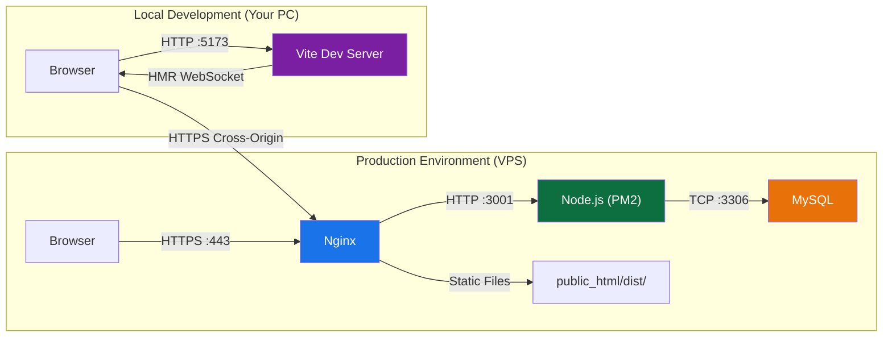
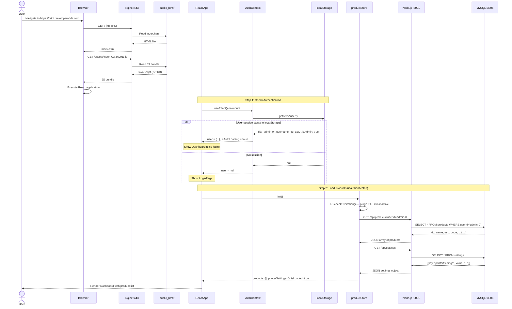
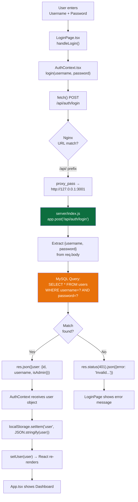
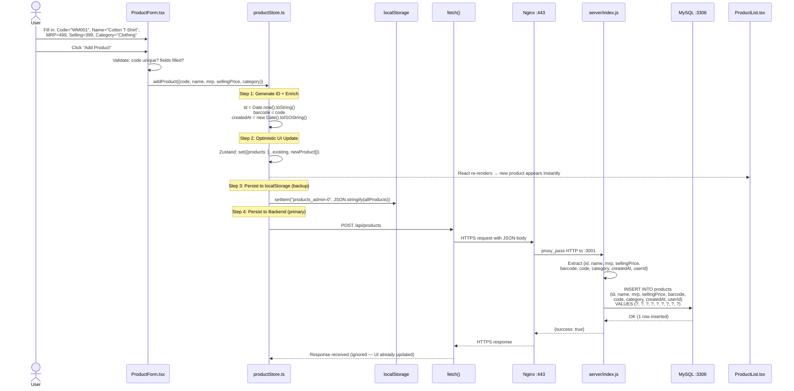
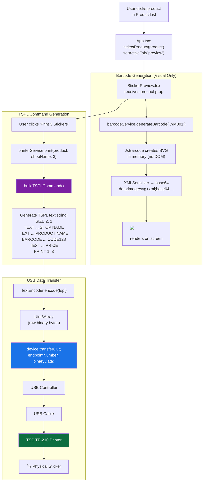
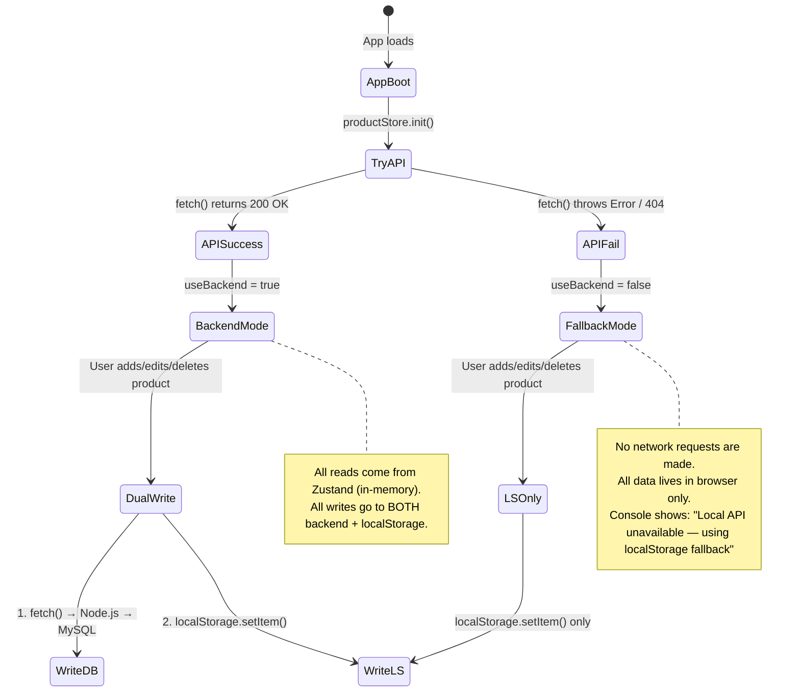
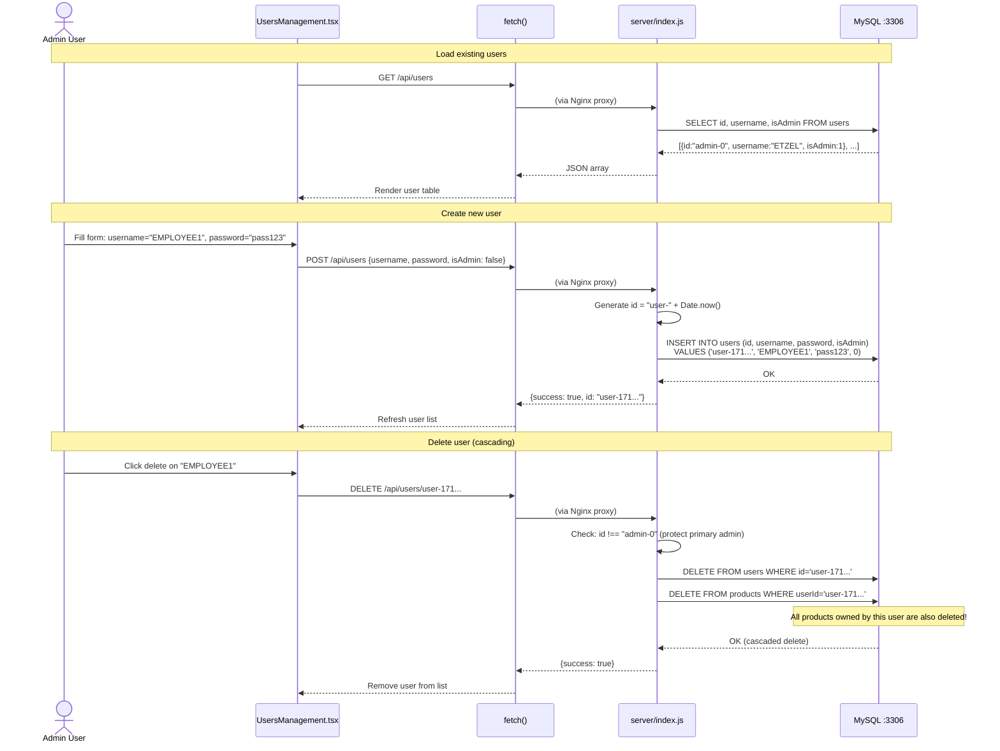

# Barcode Generator — Complete Data Flow Documentation

> **Project:** `thermal-barcode-printer` v1.0.0  
> **Author:** Shreyas  
> **License:** MIT  
> **Generated:** June 26, 2026

---

## 1. Overview

This document traces **every single data path** through the Barcode Generator application — from the moment a user types a character in the browser to the moment a physical sticker is printed or a row is saved in MySQL. It covers both the **Production (VPS)** and **Local Development** environments.

---

## 2. Environment Comparison



| Aspect | Production (VPS) | Local Development |
|--------|-----------------|-------------------|
| **Frontend served by** | Nginx (static files from `dist/`) | Vite Dev Server (`localhost:5173`) |
| **API calls go to** | Same-origin: `https://print.developeradda.com/api` | Cross-origin: `https://print.developeradda.com/api` |
| **Node.js runs on** | VPS via PM2 (port 3001) | VPS via PM2 (port 3001) — same server |
| **MySQL runs on** | VPS `localhost:3306` | VPS `localhost:3306` — same database |
| **Printer access** | WebUSB from user's browser | WebUSB from your browser |
| **Hot reload** | No (static build) | Yes (Vite HMR) |
| **VITE_API_URL** | `https://print.developeradda.com/api` | `https://print.developeradda.com/api` |

> **Critical Insight:** In both environments, the frontend talks to the **same live backend and database**. There is no separate "dev" database. Any product you add locally appears on the live site.

---

## 3. Data Flow #1: Application Boot Sequence

When a user navigates to the website, here is the exact sequence of data events:



---

## 4. Data Flow #2: User Authentication (Login)



### Data Payload Trace

| Step | Component | Data Shape |
|------|-----------|-----------|
| User Input | LoginPage.tsx | `{username: "ETZEL", password: "ETZEL1029"}` |
| HTTP Request | fetch() | `POST /api/auth/login` Body: `{"username":"ETZEL","password":"ETZEL1029"}` |
| SQL Query | server/index.js | `SELECT * FROM users WHERE username='ETZEL' AND password='ETZEL1029'` |
| SQL Result | MySQL | `[{id: "admin-0", username: "ETZEL", password: "ETZEL1029", isAdmin: 1}]` |
| HTTP Response | server/index.js | `{user: {id: "admin-0", username: "ETZEL", isAdmin: 1}}` |
| localStorage | Browser | Key: `"user"`, Value: `'{"id":"admin-0","username":"ETZEL","isAdmin":1}'` |

---

## 5. Data Flow #3: Adding a New Product



### Data Transformation Pipeline

```
User Input (Form Fields)
    ↓
{code: "WM001", name: "Cotton T-Shirt", mrp: 499, sellingPrice: 399, category: "Clothing"}
    ↓  (addProduct enrichment)
{id: "1719389234567", code: "WM001", name: "Cotton T-Shirt", mrp: 499, 
 sellingPrice: 399, barcode: "WM001", category: "Clothing",
 createdAt: "2026-06-26T06:00:34.567Z"}
    ↓  (JSON.stringify for HTTP body, adds userId)
{"id":"1719389234567","code":"WM001","name":"Cotton T-Shirt","mrp":499,
 "sellingPrice":399,"barcode":"WM001","category":"Clothing",
 "createdAt":"2026-06-26T06:00:34.567Z","userId":"admin-0"}
    ↓  (MySQL stores with DECIMAL conversion)
| id              | name           | mrp    | sellingPrice | barcode | code  | category | userId  | createdAt                  |
|-----------------|----------------|--------|--------------|---------|-------|----------|---------|----------------------------|
| 1719389234567   | Cotton T-Shirt | 499.00 | 399.00       | WM001   | WM001 | Clothing | admin-0 | 2026-06-26T06:00:34.567Z   |
    ↓  (MySQL returns DECIMAL as STRING)
{mrp: "499.00", sellingPrice: "399.00"}
    ↓  (Frontend wraps in Number() before display)
Number("499.00").toFixed(2) → "499.00" ✓
```

---

## 6. Data Flow #4: Printing a Barcode Sticker

This is the only flow that **completely bypasses the server**. Data flows from the browser's memory directly to the USB hardware.



### Data at Each Stage

| Stage | Data Type | Example |
|-------|-----------|---------|
| Product object | TypeScript `Product` | `{name: "Cotton T-Shirt", mrp: 499, code: "WM001", ...}` |
| TSPL command string | Plain text | `"SIZE 2, 1\nTEXT 55, 15, \"2\", 0, 1, 1, \"ETZEL SHOP\"\n..."` |
| Encoded binary | `Uint8Array` | `[83, 73, 90, 69, 32, 50, 44, 32, 49, 10, ...]` |
| USB transfer | Raw bytes | Sent via `transferOut()` to endpoint `0x02` |
| Physical output | Ink on paper | 50.8mm × 25.4mm sticker with barcode |

---

## 7. Data Flow #5: The localStorage Fallback Mechanism

This is the graceful degradation system that allows the app to work even when the backend is unreachable.



### localStorage Key Map

| Key | Data | Format |
|-----|------|--------|
| `user` | Current logged-in user | `{"id":"admin-0","username":"ETZEL","isAdmin":true}` |
| `products_admin-0` | Products owned by user admin-0 | `[{id, name, mrp, ...}, ...]` |
| `products_user-1719...` | Products owned by another user | Same format |
| `printerSettings` | Printer configuration | `{"type":"usb","paperWidth":"80"}` |
| `shopName` | Shop name for sticker printing | `"ETZEL SHOP"` |
| `lastActive` | Timestamp of last user activity | `"1719389234567"` |
| `theme` | Dark/light mode preference | `"dark"` or `"light"` |

### Expiration Logic
If `lastActive` is older than **5 minutes**, all product and printer data in localStorage is automatically purged. This prevents stale data from persisting when the user returns after being away.

---

## 8. Data Flow #6: User Management (Admin Only)



---

## 9. Network Request Map (Complete)

Every single HTTP request the frontend can make:

| # | Trigger | Method | URL | Request Body | Response | Component |
|---|---------|--------|-----|-------------|----------|-----------|
| 1 | App boot | GET | `/api/products?userId=X` | — | `[{Product}, ...]` | productStore.init() |
| 2 | App boot | GET | `/api/settings` | — | `{printerSettings: {...}}` | productStore.init() |
| 3 | Login | POST | `/api/auth/login` | `{username, password}` | `{user: {id, username, isAdmin}}` | AuthContext.login() |
| 4 | Add product | POST | `/api/products` | `{id, name, mrp, ...userId}` | `{success: true}` | productStore.addProduct() |
| 5 | Edit product | PUT | `/api/products/:id` | `{name?, mrp?, ...}` | `{success: true}` | productStore.updateProduct() |
| 6 | Delete product | DELETE | `/api/products/:id` | — | `{success: true}` | productStore.deleteProduct() |
| 7 | Save settings | POST | `/api/settings` | `{key, value}` | `{success: true}` | productStore.setPrinterSettings() |
| 8 | List users | GET | `/api/users` | — | `[{id, username, isAdmin}, ...]` | UsersManagement.tsx |
| 9 | Create user | POST | `/api/users` | `{username, password, isAdmin}` | `{success: true, id}` | UsersManagement.tsx |
| 10 | Delete user | DELETE | `/api/users/:id` | — | `{success: true}` | UsersManagement.tsx |

---

## 10. Component-to-Component Data Connections

This table shows exactly which component passes data to which other component, and what data flows between them:

| From | To | Data Passed | Mechanism |
|------|----|------------|-----------|
| `main.tsx` | `AuthProvider` | React children | JSX wrapping |
| `AuthProvider` | `App.tsx` | `{user, isAuthLoading, login, logout}` | React Context |
| `App.tsx` | `ProductForm` | *(none — reads from store)* | Zustand |
| `App.tsx` | `ProductList` | `{onSelectProduct, selectedProductId}` | Props |
| `App.tsx` | `StickerPreview` | `{product, quantity, shopName}` | Props |
| `App.tsx` | `PrinterSettings` | *(none — reads from store)* | Zustand |
| `App.tsx` | `UsersManagement` | *(none — fetches directly)* | fetch() |
| `ProductList` | `EditProductModal` | `{product, onClose}` | Props |
| `ProductList` | `App.tsx` | Selected product | `onSelectProduct` callback |
| `ProductForm` | `productStore` | New product data | `addProduct()` |
| `EditProductModal` | `productStore` | Updated product fields | `updateProduct()` |
| `StickerPreview` | `barcodeService` | Product code string | Function call |
| `StickerPreview` | `printerService` | `{product, shopName, quantity}` | `print()` |
| `printerService` | WebUSB | Binary TSPL data | `device.transferOut()` |
| `productStore` | `server/index.js` | JSON via HTTP | `fetch()` |
| `server/index.js` | MySQL | SQL queries | `pool.query()` |
| `AuthContext` | `productStore` | `reset()` on logout | Dynamic import |
