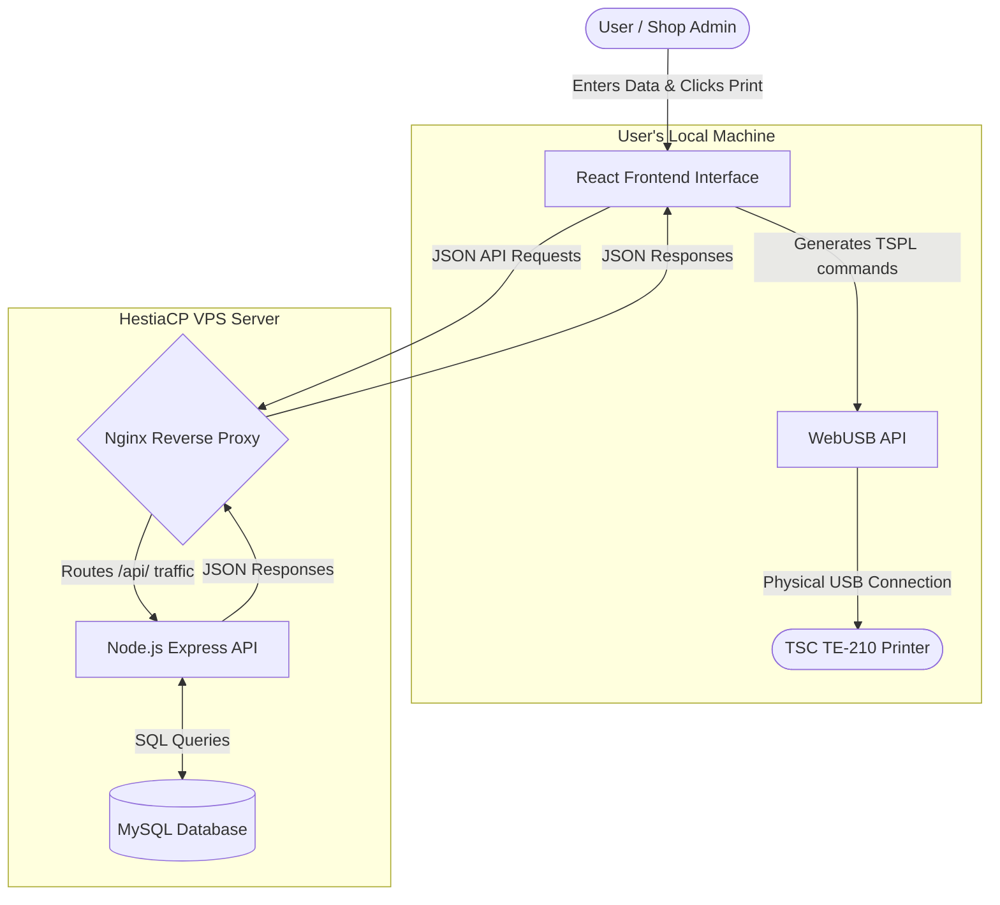

# Barcode Generator - Project & Data Flow Summary

This document provides a comprehensive overview of the system architecture, components, and data flow of the Barcode Generator application. This information can be directly translated into a Level 0 and Level 1 Data Flow Diagram (DFD).

## 1. System Components (Entities & Processes)

1. **Client / User (External Entity):** The shop administrator or employee interacting with the web browser.
2. **React Frontend (Process):** The user interface built with Vite, React, and Zustand (for local state management). Responsible for rendering data, capturing input, and generating TSPL print commands.
3. **Nginx Reverse Proxy (Process/Router):** The web server running on HestiaCP that routes internet traffic. It securely intercepts `/api` calls and forwards them to the backend.
4. **Node.js + Express Backend (Process):** The REST API server running on port 3001 via PM2. Responsible for business logic, authentication, and securely interacting with the database.
5. **MySQL Database (Data Store):** The persistent storage layer maintaining records of users, products, and settings.
6. **TSC TE-210 Printer (External Hardware Entity):** The thermal printer connected locally via USB, receiving raw TSPL commands directly from the browser.

---

## 2. Data Models (Data Stores)

The MySQL Database contains three primary tables:
- **`users`**: Stores `id`, `username`, `password`, and `isAdmin` status.
- **`products`**: Stores product details including `id`, `name`, `mrp`, `sellingPrice`, `barcode`, `code`, `category`, `createdAt`, and the associated `userId`.
- **`settings`**: A key-value store containing application-level configuration (e.g., connected printer details, shop names).

---

## 3. Core Data Flow Processes

### A. Authentication Flow (Login)
1. **User** enters credentials into the **React Frontend**.
2. **Frontend** sends a `POST /api/auth/login` request (containing JSON `{username, password}`) to **Nginx**.
3. **Nginx** forwards the JSON to the **Node.js Backend**.
4. **Backend** queries the **MySQL Database** (`SELECT * FROM users WHERE username = ? AND password = ?`).
5. **Database** returns the user record (or empty) to the **Backend**.
6. **Backend** sends a success JSON response `{"user": {...}}` (or 401 Error) back through Nginx to the **Frontend**.
7. **Frontend** saves the user session in `localStorage` and updates the UI state.

### B. Product Management Flow (Create / Fetch / Update)
1. **User** opens the dashboard; **Frontend** sends `GET /api/products?userId=<id>` to the **Backend**.
2. **Backend** fetches rows from the **MySQL `products` table** and returns a JSON array.
3. When the **User** adds a new product, the **Frontend** sends a `POST /api/products` request containing the product payload.
4. **Backend** executes an `INSERT INTO products` SQL query.
5. **Database** confirms insertion, and **Backend** replies with `{"success": true}`.
6. **Frontend** updates its local Zustand state manager so the user instantly sees the new product without refreshing.

### C. Hardware Integration Flow (Printing)
*(Note: This flow completely bypasses the backend and database).*
1. **User** clicks "Print" on a specific product in the **React Frontend**.
2. **Frontend** calls the `barcodeService` to generate a visual barcode representation (base64 image) for on-screen preview.
3. **Frontend** calls the `printerService`, translating the product data (`name`, `mrp`, `sellingPrice`, `code`) into raw **TSPL Printer Commands** (text format).
4. **Frontend** requests access to the local USB port via the **WebUSB API** (`navigator.usb`).
5. **User** grants browser permission to connect to the hardware.
6. **Frontend** sends the raw TSPL command packet directly over the physical USB cable to the **TSC TE-210 Printer**.
7. The **Printer** prints the physical sticker.

---

## 4. Visual Data Flow Diagram (DFD Level 0/1 Hybrid)

You can use the following logic for your DFD software:

