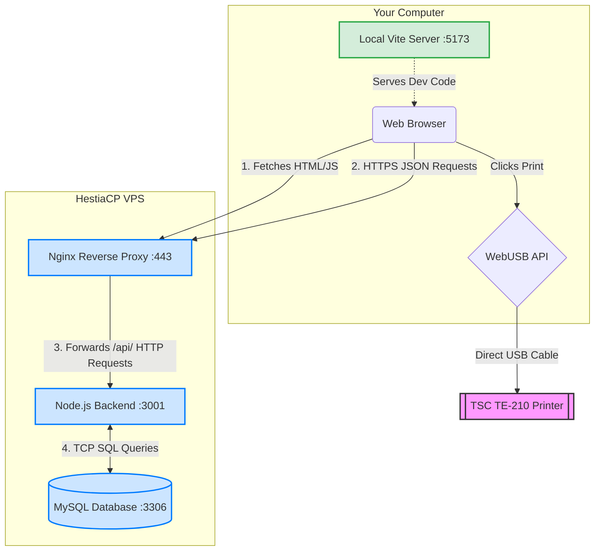

# In-Depth Data Flow Architecture

This document maps out exactly how data travels through the Barcode Generator application. It compares the data flow in the **Production (VPS)** environment versus the **Local Development (Your PC)** environment, detailing the components and their connections.

---

## 1. The Production Data Flow (Running on HestiaCP VPS)

When a user accesses your live application over the internet, data flows through several secure layers.

### Component Map & Ports (VPS)
* **User's Web Browser:** Executes the React Frontend.
* **Nginx Reverse Proxy:** Listens on Port `443` (HTTPS).
* **Node.js Backend:** Listens internally on Port `3001` (HTTP).
* **MySQL Database:** Listens internally on Port `3306` (TCP).
* **TSC Printer:** Connected via physical USB.

### Detailed Data Flow Path
1. **Initial Load (Browser ↔ Nginx):**
   * The user types `https://print.developeradda.com` into their browser.
   * **Nginx** (acting as a file server) receives the request on Port 443.
   * Nginx grabs the static `index.html` and `assets/*.js` files from `/public_html` and sends them to the browser.
   * The browser executes the React application.

2. **API Request Flow (Browser ↔ Nginx ↔ Node.js):**
   * The user performs an action (e.g., clicking "Add Product").
   * The React app creates a JSON object representing the product.
   * React makes an HTTPS `fetch()` request to `https://print.developeradda.com/api/products`.
   * **Nginx** intercepts this `/api/` request on Port 443.
   * Nginx instantly decrypts the HTTPS traffic and passes the JSON data (Proxy Pass) internally to `http://127.0.0.1:3001`.
   * The **Node.js Backend** receives the JSON request on Port 3001.

3. **Database Execution Flow (Node.js ↔ MySQL):**
   * Node.js parses the JSON and constructs a secure SQL query (e.g., `INSERT INTO products...`).
   * Node.js uses the `mysql2` driver to send this SQL command over TCP to `127.0.0.1:3306` (the MySQL Database).
   * **MySQL** executes the query, saves the data to the hard drive, and returns a success confirmation to Node.js.
   * Node.js converts that confirmation into a JSON response `{"success": true}` and sends it back to Nginx.
   * Nginx encrypts it and sends it back to the user's browser.
   * React receives the JSON and updates the UI.

4. **Hardware Data Flow (Browser ↔ USB Printer):**
   * **Crucial distinction:** Print data *never* goes to the server.
   * The user clicks "Print".
   * React takes the product data from its local memory and formats it into a raw string of **TSPL Printer Commands**.
   * React uses the `WebUSB API` (`navigator.usb`) to open a direct data pipeline to the physical USB port on the user's computer.
   * The raw text data is blasted directly down the USB cable to the **TSC TE-210 Printer**.

---

## 2. The Local Development Data Flow (Running on Your PC)

When you are coding and testing on your local machine, the data flow is slightly different because you are bridging your local environment with the live production database.

### Component Map & Ports (Local)
* **Vite Dev Server (Frontend):** Runs on `http://localhost:5173`.
* **Node.js Backend (Not Running Locally):** You are bypassing the local backend.
* **Live MySQL Database (Remote):** Listens on the VPS IP `103.235.105.67:3306`.
* **Live Node.js Backend (Remote):** Running on the VPS.

### Detailed Data Flow Path
1. **Initial Load (Localhost ↔ Vite Server):**
   * You run `npm run dev` in VS Code.
   * The Vite Dev Server compiles your React code in real-time.
   * You open `http://localhost:5173`. The browser loads the uncompiled React code directly from your local hard drive.

2. **API Request Flow (Local Browser ↔ Live Nginx ↔ Live Node.js):**
   * Because your local `.env` file specifies `VITE_API_URL=https://print.developeradda.com/api`, your local frontend does **not** talk to a local backend.
   * When you click "Add Product" locally, your browser makes a cross-origin HTTPS `fetch()` request directly to the **Live VPS Server** over the internet.
   * The live **Nginx** server on the VPS catches the request, passes it to the live **Node.js** server, which saves it in the live **MySQL** database.
   * *This means any data you add or delete while running `localhost:5173` is actually happening on the production database!*

3. **Alternative Local Flow (Testing Backend Changes):**
   * If you were writing new backend code and needed to test it locally without affecting the live server:
   * You would change your frontend `.env` to `VITE_API_URL=http://localhost:3001/api`.
   * You would run `node server/index.js` in a second terminal.
   * You would change your backend `.env` to point `DB_HOST` to the VPS IP `103.235.105.67` with the password `Print@2026`.
   * **The Flow:** Local Browser → Local Node.js Server → Internet → Live MySQL Database.

---

## 3. Visual Architecture Diagram

